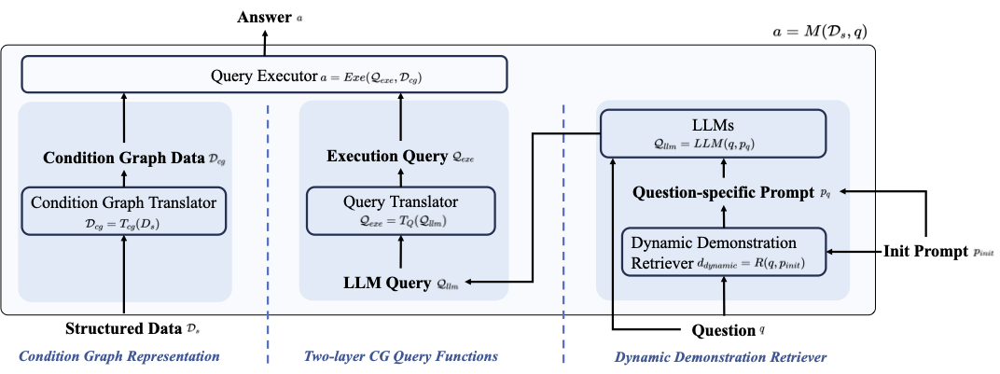

# TrustUQA: A Trustful Framework for Unified Structured Data Question Answering

 [](https://github.com/zjukg/DUET/blob/main/licence) [](https://arxiv.org/abs/2305.06152) [](https://aaai.org/Conferences/AAAI-25/) [](https://pytorch.org/)

## 📕 Introduction

This is the code of the paper [TrustUQA: A Trustful Framework for Unified Structured Data Question](https://arxiv.org/abs/2406.18916) (AAAI 2025).

> Natural language question answering (QA) over structured data sources such as tables and knowledge graphs have been widely investigated, especially with Large Language Models (LLMs) in recent years. The main solutions include question to formal query parsing and retrieval-based answer generation. However, current methods of the former often suffer from weak generalization, failing to dealing with multi-types of sources, while the later is limited in trustfulness. In this paper, we propose TrustUQA, a trustful QA framework that can simultaneously support multiple types of structured data in a unified way. To this end, it adopts an LLM-friendly and unified knowledge representation method called Condition Graph (CG), and uses an LLM and demonstration-based two-level method for CG querying. For enhancement, it is also equipped with dynamic demonstration  retrieval. We have evaluated TrustUQA with 5 benchmarks covering 3 types of structured data. It outperforms 2 existing unified structured data QA methods. In comparison with the baselines that are specific to one data type, it achieves state-of-the-art on 2 of the datasets. Further more,  we have demonstrated the potential of our method for more general QA tasks, QA over mixed structured data and QA across structured data. The code is available in the supplementary material.

## 🌈 Model Architecture



## 📚 Dataset Download

We strongly suggest that download the processed datasets from [here](https://drive.google.com/drive/folders/1dNOPcpRVSVSGttrPKCzLdnlMvKmkE0w_?usp=drive_link) and then directly use them. After downloading our processed data, you can unzip and put them in the */dataset* directory.

## 💡 **Quick start**

**STEP1** Create a virtual environment using Anaconda and enter it

```bash
conda create -n TrustUQA python=3.8
conda activate TrustUQA
```

**STEP2** Install requirements

```bash
pip install -r requirements.txt
```

**STEP3** Running scripts

```bash
# WikiSQL
>> bash scripts/wikisql.sh

# WTQ
>> bash scripts/wtq.sh

# MetaQA
>> bash scripts/metaqa/metaqa_1hop.sh
>> bash scripts/metaqa/metaqa_2hop.sh
>> bash scripts/metaqa/metaqa_3hop.sh

# WebQSP
>> bash scripts/wqsp.sh

# CronQuestion
>> bash scripts/cronquestion.sh
```

**NOTE:**

1. Please write the API key in `api_key.txt` before running the code. The number of keys in `api_key.txt` should be equal to `num_process`.
2. Replace the `openai_url` in `scripts` as needed.

## 🤝 Cite

Please consider citing this paper if you use the ``code`` or ``data`` from our work. Thanks a lot :)

```bigquery
@inproceedings{DBLP:conf/aaai/TrustUQA,
  author       = {Wen Zhang and
                  Long Jin and
                  Yushan Zhu and
                  Jiaoyan Chen and
                  Zhiwei Huang and
                  Junjie Wang and
                  Yin Hua and
                  Lei Liang and
                  Huajun Chen},
  title        = {TrustUQA: {A} Trustful Framework for Unified Structured Data Question
                  Answering},
  booktitle    = {{AAAI}},
  publisher    = {{AAAI} Press},
  year         = {2025}
}
```
